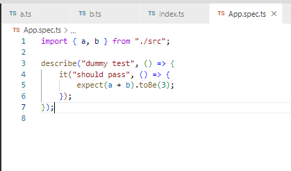
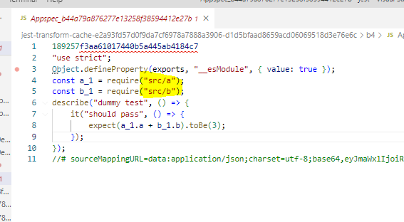

# Barrel Import Transformer overview

This is just a **sample code** to demonstrate how we can have a custom barrel import transformer to gain performance improvements when running Jest test
in a project with Barrel imports.

**Note 1** - **transformParameters.ts** can be updated to configure condition which the transform uses in this file

**Note 2** - **printLog** when declared in a file contains console log statement and can be used easily commented to not have logs in test output. Just something to help follow the transform flow.

**Note 3** - When running the transform make sure to clear the jest cache - npx jest --clearCache

1. The test the sample start to execute when running script and observe the code generate in jest cache directory. Command to run - **npm test**

2. The barrel-import-transform steps runs which dumps all the exports from file pattern specified in **transformParameters.ts**

3. Then test starts to execute and ts/tsx files are passed to the **barrelImportTransformerProcessor.ts** which transforms the file to convert the barrel import into specific import by looking at the exports contained in the **importLookupData.json** file generated in step 2.

4. The import is only transformed when **shouldTransformImportDeclarationCriteria** in **transformParameters.ts** returns true for a import statement currently processed by transformer.

5. The change in the import statement might effect the **jest.mock** setup for test files hence the **barrelImportTransformer.ts** file contains code in **updateJestMockStatements** function to automatically transform the jest.mock statements as well. This doesnt work 100% of the time and will need manual fix to the test files.

> For e.g, a spec file with import statement and mock setup like -
**import { a } from './src';
jest.mock('./src', moduleFactoryFn);**
will be auto converted to below. This should be ok for the most part but if it doesnt work then test should be modified to correct the mock declarations -
**import { a } from './src/a';
jest.mock('./src/a', moduleFactoryFn);**

## Input -

## Output -

